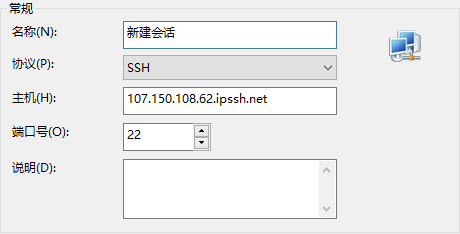

# GlobalSSH


## 产品介绍

GlobalSSH是一款致力于提高跨国远程管理服务器效率的产品，旨在解决由于跨国网络不稳定导致的远程管理出现的卡顿、连接失败、传输速度较慢等现象。本产品可极大程度的减少卡顿、连接失败的情况发生，提高运维工作的效率。  
注：本产品同样适用于windows服务器的远程登陆服务。如因客户使用场景不是SSH，远程登录等情况导致ddos或网络封堵，产品方保留删除实例权利。


## 场景示例

由于业务需要，某公司的服务器托管于国外，而运维人员在国内办公，经常需要通过SSH登录的方式管理服务器。但是由于网络的波动，通过SSH管理服务器时，经常会出现卡顿、连接失败、传输速度较慢等现象，容易导致运维工作出错、效率变慢，从而影响运维工作的正常运行。

## 版本说明

 以下版本均支持加速非UCloud平台的IP。
 
 * 公测版：公测期间创建的实例，目前已无法继续创建，已有资源可正常使用。

 * 免费版：免费使用，不限制实例数量，7日内未使用即回收资源实例，仅支持加速22/3389端口，加速端口为后端随机分配，可能与服务器端口不一致，不支持修改服务器端口。
 
 * 基础版：适用于流量需求较小的日常运维场景，加速端口与服务器端口保持一致，支持修改服务器端口。

 * 企业版：适用于传数据、跨境电商等流量需求较大的场景。
 
 版本对比：
 


## 场景限制
1）GlobalSSH产品定位是方便海外云主机运维管理，故禁止了80、443端口来杜绝大部分web服务，65123作为系统保留端口，也不对外开放。

2）如果您的业务需要支持更多的端口和更大的带宽，欢迎使用PathX （带宽充足可共享，最多支持50个端口）。

3）如果需要对同一台云主机加速访问多个端口，除了PathX方案，可以考虑使用SSH端口转发，即本地端口代理访问远端服务端口，请确保云主机的sshd配置支持端口转发。命令如下：
```
ssh -L localhost:6443:localhost:6443 root@103.14.35.114.ipssh.net
```

## 如何创建

#### 云主机/EIP产品入口创建

1.进入云主机/EIP产品列表，点击GlobalSSH的灰色图标  


2.选择版本、服务器靠近区域、端口，点击确定按钮创建  


#### PathX入口创建

1.进入PathX产品下的GlobalSSH标签页，点击创建按钮  


2.输入需要加速的服务器IP，选择可覆盖你服务器物理位置的区域选项，输入服务器端口号并创建。  
如：假设服务器在华盛顿，选择华盛顿选项即可；假设服务器在曼谷，可选择能覆盖曼谷区域的香港或新加坡选项  


免费版GlobalSSH采用共享IP的方式，不同的实例会分配不同的端口用于SSH连接，因此GlobalSSH端口与服务器端口不一致。

## 如何使用

成功创建后，会生成一个类似xxx.ipssh.net的域名  
  
注：ipssh.net为GlobalSSH产品的正式域名，部分ucloudgda.com结尾的加速域名仍可使用  

**Linux系统**  

在远程登录工具中，使用**加速域名**进行登录。

图形界面连接示意：



命令行登录示意（CentOS）:  
```
ssh {用户名}@{AcceleratingDomain}
```
免费版：
```
ssh {用户名}@{AcceleratingDomain} -p ${GlobalSSHPort}
```

友情提示，当您使用其他友商云主机或不同linux发行版，注意SSH登陆的用户名可能不同

**Windows系统**  
远程桌面连接，以默认端口3389为例，打开系统RDP客户端，计算机处填写加速域名${AcceleratingDomain}，免费版为${AcceleratingDomain}:${GlobalSSHPort}。输入用户名及密码点击连接，即可。

## 产品价格

 * 免费版：免费使用。 
 
 * 基础版：20元/月。

 * 企业版：60元/月。
 
## 回收逻辑

公测版：7日内单个实例累计出向流量小于2MB，即进行资源实例回收。

免费版：7日内完全未使用，即进行资源实例回收。

基本版、企业版：资源过期后第10天进行回收。

若您希望继续使用，可通过如下方式恢复：  

1、登陆UCloud控制台，主机列表页点击目标EIP右侧的SSH图标，在弹出框内（可修改端口等参数）点确认按钮重新创建。  

2、使用UCloud CLI资源管理工具，在您熟悉的命令行工具中执行 
```
ucloud gssh create --location $Location --target-ip $EIP --port $Port
```
3、登陆UCloud控制台PathX产品下 GlobalSSH列表，选择离源站较近的区域，填写源站IP，重新开通即可。

## FAQ

**如何使用 GlobalSSH 白名单功能？**  
该白名单不同于源站的防火墙白名单，仅用来控制可以访问GlobalSSH的来源IP。在GlobalSSH管理列表，点击查看详情，在详情页面左侧基本信息-白名单，进行编辑添加，支持IPv4段或多个IPv4地址。

**使用 GlobalSSH 端口不通**   
1）实例运行需要1分钟的启动时间。超出该时间后，先确认源站的相同端口是否可以连接；

2）在 GlobalSSH 实例详情页，检查下访问白名单，如果配置了白名单，出现在白名单中的IP才可以连接；

3）中国大陆地区Ping GlobalSSH 的域名，如果可以 Ping 通，试试 telnet GlobalSSH域名 端口 是否可以连接（无法连接提供给我们）；如果 Ping 不通，请dig下 GlobalSSH域名，将结果提供给我们。

